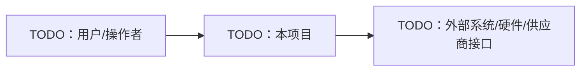
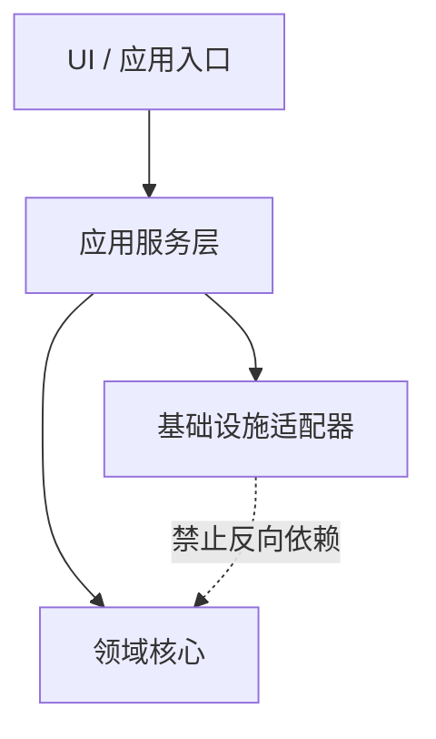
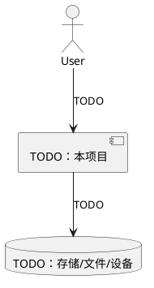

<!-- Copyright The Project Template Contributors -->

# AGENTS.md

> **模板使用说明**
>
> 本文件来自公司项目模板，不是可原样长期保留的项目规则。
>
> 从模板创建新项目后，必须根据项目实际情况修改本文件，至少补齐项目概览、架构边界、项目级硬约束、AI agent 工作流和项目状态。凡是带 `TODO` 的内容都必须替换；不适用于当前项目的规则应删除或改写；新增的项目级约定应写入本文件、`docs/conventions.md` 或对应目录的局部 `AGENTS.md`。
>
> 若本文件仍保留明显模板占位内容，不应视为项目协作规则已经完成。
>
> **模板仓库维护者说明**
>
> 维护 `project-template` 仓库时，本文件中的 `TODO` 和示例内容是模板交付物的一部分。除非本次变更目标就是调整模板占位策略，否则不要把这些占位内容替换成 `project-template` 仓库自身信息。
>
> 本仓库自身的维护规则是：保持模板内容通用、环境无关、可被派生项目替换；不要写入个人机器路径、个人开发环境、私有凭据，或只适用于某个维护者的配置。
>
> 若一条规则同时适用于模板仓库和派生项目，应优先写成可复制的项目级约定；只适用于模板仓库维护流程的内容，应在 `README.md` 或 `CONTRIBUTING.md` 中明确标注。

本文件是本项目面向**人类贡献者和 AI agent** 的项目级入口与真值源。

当 `README.md`、贡献指南、ADR、RFC、计划文档、设计文档、代码注释或 AI 记忆与本文件冲突时，**以本文件为准**。冲突本身是一个文档缺陷，发现后应在同一个变更中修正。

## 项目概览

- **项目名称**：TODO
- **业务/产品领域**：TODO
- **目标用户**：TODO
- **项目负责人**：TODO
- **主要技术栈**：TODO
- **目标运行环境**：TODO，例如 Windows/macOS/Linux、x64/arm64、嵌入式目标、浏览器、云端运行时。

一句话说明：

> TODO：说明本项目解决什么问题、服务什么场景、哪些核心假设必须长期保持成立。

## 文档入口

| 文档 | 用途 |
|------|------|
| `README.md` | 项目介绍、环境准备、安装、编译、运行、测试、打包、发布 |
| `CONTRIBUTING.md` | 人类贡献流程、PR 要求、review 要求 |
| `docs/conventions.md` | 语言、文档、测试、安全、Dev Container 等长期约定 |
| `docs/git.md` | Git 工作流、commit 规范、DCO、破坏性操作规则 |
| `docs/SAD.md` | 可选，Software Architecture Document，描述当前软件架构、约束、视图和质量属性 |
| `docs/SDD.md` | 可选，Software Design Document，描述当前系统或子系统设计细节 |
| `docs/adr/` | 已经做出的架构决策 |
| `docs/rfcs/` | 决策前的较大提案 |
| `docs/specs/` | 功能或子系统设计 |
| `docs/plans/` | 可执行实施计划 |
| `docs/templates/` | 局部 `AGENTS.md`、硬件设计、供应商记录、SOP 等可复制模板 |
| `docs/hardware/` | 可选，硬件设计、接口、BOM、夹具、验证记录 |
| `docs/production/` | 可选，生产、发布、验收、回滚流程 |
| `docs/suppliers/` | 可选，供应商、外协、第三方交付物记录 |
| `docs/sop/` | 可选，标准作业流程 |
| 局部 `AGENTS.md` | 某个目录/模块的局部规则，补充根目录规则 |

本文件只保留 AI agent 必须先读的项目级规则。贡献指南、Git 规范、文档规范等细节放在上表对应文件中维护。

## 语言策略

- 项目以中文为首选语言。
- 文档、注释、ADR、RFC、Spec、Plan、提交信息、PR 描述和用户可见文案优先使用中文。
- 技术术语、行业术语、专有名词、缩写、协议名、标准名、产品名、代码变量、函数名、类型名、模块名、文件名、命令、配置键、环境变量等保持英文或其所在生态的通用写法。
- 不为了“全中文”而翻译已经稳定的英文术语，例如 API、SDK、CLI、CI、CD、HTTP、JSON、schema、runtime、adapter、plugin、handler、callback、middleware。

## 依赖与环境策略

- 原则上，项目使用的包、依赖、工具链、基础镜像和开发环境应采用当前可用的最新稳定版本。
- 开发工具、构建工具、语言工具链、SDK、模拟器、数据库客户端、pre-commit hooks，以及开发、编译、测试、生成、打包、发布过程中用到的二进制文件，默认必须安装并运行在 Dev Container 或 CI/self-hosted runner 声明的隔离环境中，不应要求贡献者修改宿主机全局环境。
- 依赖和环境需要持续更新，不能长期停留在模板创建时的版本。
- 版本固定是为了可复现，而不是为了永久冻结；固定版本必须有升级路径。
- 出于兼容性、认证、安全或硬件限制不能使用最新版本时，必须在 `README.md`、`docs/conventions.md` 或对应 ADR 中说明原因、影响范围和重新评估条件。

## 架构边界

> 创建新项目时，替换成本项目真实架构。

本节必须用可执行的结构说明项目架构。能画图时优先使用 Mermaid 或 PlantUML，图和文字必须保持同步。

如果项目维护 `docs/SAD.md` 或 `docs/SDD.md`，本节应保留最高优先级的不变量和阅读入口；SAD/SDD 承载更完整的架构视图和设计细节。二者冲突时，必须在同一个变更中修正。

### 系统上下文

说明本项目运行在什么环境中，与哪些用户、外部系统、硬件、云服务、供应商系统或生产流程交互。

### 模块职责

| 模块/目录 | 职责 | 不负责 | 对外边界 |
|-----------|------|--------|----------|
| TODO | TODO | TODO | TODO |

### 依赖方向

说明模块之间允许和禁止的依赖方向。示例：

### 运行时模型

说明进程、线程、任务、队列、调度周期、实时性、资源所有权、生命周期和清理方式。

| 运行单元 | 频率/触发 | 调度/隔离 | 资源所有权 | 失败处理 |
|----------|-----------|-----------|------------|----------|
| TODO | TODO | TODO | TODO | TODO |

### 外部接口与数据流

说明公开 API、IPC、协议、文件格式、数据库 schema、消息主题、硬件链路和供应商交付物。

### 禁止跨越的边界

- TODO：哪些模块不能直接依赖哪些模块。
- TODO：哪些代码不能访问硬件、网络、文件系统、生产数据或全局状态。
- TODO：哪些生成文件、供应商交付物或生产配置不能作为唯一真值源。
- TODO：哪些平台假设必须隔离在适配层后。

架构规则：

1. 依赖方向必须明确。
2. 新增跨模块依赖时，PR 描述必须说明理由。
3. 公开 API、数据模型、存储结构、协议边界变化，必须在 PR 描述中显式标注，并按影响同步更新 SAD/SDD/Spec。
4. 如果一个架构决策不明显，或拒绝了一个合理备选方案，应写 ADR。

## 项目级硬约束

> 创建新项目时，根据项目风险补充或收紧本节。

默认约束：

1. 不引入未文档化的平台假设。
2. 不提交密钥、私钥、token、证书、生产 `.env` 或机器本地路径。
3. 不绕过 CI、测试、hook、签名、review 门禁，除非获得明确批准。
4. 不把生成文件作为唯一真值源；必须记录生成器和源输入。
5. 不引入隐藏全局状态，除非说明生命周期、所有权和清理方式。
6. 平台特定逻辑必须隔离在清晰边界后，并有对应测试或验证路径。
7. 破坏性操作需要人工确认，包括 force push、重写历史、批量删除、reset、生产数据修改。

## AI Agent 工作流

AI agent 是正式贡献者，必须遵守与人类相同的规则。

开始修改前，agent 必须：

1. 阅读根目录 `AGENTS.md`。
2. 阅读 `README.md`，获取项目实际命令。
3. 阅读 `CONTRIBUTING.md`、`docs/conventions.md` 和 `docs/git.md`。
4. 阅读将要修改目录下最近的局部 `AGENTS.md`。
5. 如果任务涉及架构、设计或计划，阅读相关 ADR/RFC/spec/plan。
6. 检查当前工作区状态，不回退用户或其他贡献者的改动。

实施过程中，agent 必须：

1. 保持改动范围与任务目标一致。
2. 优先沿用项目既有模式，而不是引入新抽象。
3. 如果按 `docs/plans/` 执行任务，随着进度更新 checklist。
4. 根据风险补充或更新测试。
5. 行为、架构、命令、约束发生变化时，同步更新文档。

结束前，agent 必须：

1. 运行 `README.md` 中与改动相关的验证命令。
2. 明确说明哪些验证已运行、哪些未运行。
3. 总结主要改动文件和残余风险。
4. 不声称跨平台支持，除非 CI matrix 或原生平台验证已经证明。

## 项目状态

> 保持简短，并定期更新。

**最后审阅日期**：YYYY-MM-DD

- 当前阶段：TODO
- 活跃计划：TODO
- 已知技术债：TODO
- 下一个里程碑：TODO
