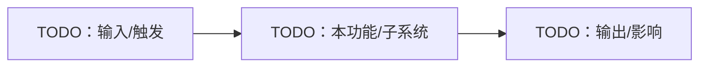

<!-- Copyright The Project Template Contributors -->

# YYYY-MM-DD 主题设计

**日期**：YYYY-MM-DD
**负责人**：TODO
**关联**：TODO
**状态**：草案

## 概述

描述功能或子系统。

## 目标

- TODO

## 非目标

- TODO

## 当前状态

描述现有系统和约束。

## 设计方案

描述足够支持实施计划的设计细节。

## 数据模型 / API / UI

TODO：只保留适用的小节。

## 硬件 / 生产 / 供应商 / SOP

> 不适用时删除本节。

- 硬件设计文档：TODO
- 生产或部署 SOP：TODO
- 供应商记录或第三方交付物：TODO
- Docker/Dev Container 产物路径：TODO：宿主机路径与容器内路径必须匹配
- 需要更新的图表：TODO：Mermaid / PlantUML

## 风险

- TODO

## 开放问题

- TODO

## 实施计划链接

TODO
