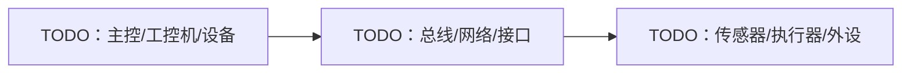

<!-- Copyright The Project Template Contributors -->

# YYYY-MM-DD TODO 硬件设计

> **使用说明**
>
> 适用于硬件拓扑、接口、生产夹具、嵌入式目标、实验室验证或供应商交付物相关设计。复制到 `docs/hardware/` 后填写。

## 背景

- 目标产品/子系统：TODO
- 适用版本/批次：TODO
- 关联 Spec/Plan/ADR：TODO
- 关联供应商记录：TODO

## 系统拓扑

## 接口与信号

| 接口/信号 | 方向 | 协议/电气约束 | 频率/带宽 | 连接器/引脚 | 说明 |
|-----------|------|---------------|-----------|-------------|------|
| TODO | TODO | TODO | TODO | TODO | TODO |

## 机械与生产约束

| 项目 | 要求 | 验收方式 |
|------|------|----------|
| 安装空间/外形 | TODO | TODO |
| 线束/连接器 | TODO | TODO |
| 散热/功耗 | TODO | TODO |
| 防护/环境 | TODO | TODO |
| 生产夹具 | TODO | TODO |

## 固件、第三方源码与供应商交付物

| 交付物 | 来源 | 集成方式 | 版本/校验 | 许可证/限制 | 验证方式 |
|--------|------|----------|-----------|-------------|----------|
| TODO | TODO | TODO：3rd submodule / vendor / 包管理器 / 下载脚本 | TODO | TODO | TODO |

自带包管理器管理的依赖不记录为 `3rd/` 源码；只记录 manifest/lockfile、版本策略和验证命令。

## 验证计划

| 验证项 | 命令/步骤 | 运行位置 | 需要硬件 | 超时 | 通过标准 |
|--------|-----------|----------|----------|------|----------|
| 容器构建 | TODO | TODO：常驻 Dev Container / CI | 否 | TODO | TODO |
| 仿真/模拟器 | TODO | TODO：常驻 Dev Container / CI | 否 | TODO | TODO |
| 硬件 bring-up | TODO | TODO：常驻 Dev Container 透传设备 / self-hosted runner | 是 | TODO | TODO |
| 生产夹具测试 | TODO | TODO：产线容器环境 / self-hosted runner | 是 | TODO | TODO |

## 风险与开放问题

- TODO
