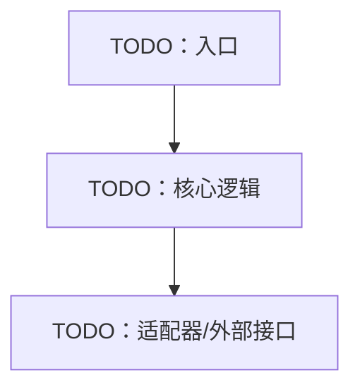

<!-- Copyright The Project Template Contributors -->

# TODO 路径/模块 AGENTS.md

> **使用说明**
>
> 将本文件复制到模块、crate、服务、硬件子系统或重要目录根部，并改名为 `AGENTS.md`。删除不适用章节，补齐所有 `TODO`。
>
> 局部 `AGENTS.md` 只记录该目录的局部规则；跨项目通用规则仍由根目录 `AGENTS.md` 和 `docs/conventions.md` 负责。

## 模块概览

- **路径**：TODO
- **职责**：TODO
- **不负责**：TODO
- **所属层次/边界**：TODO
- **目标运行环境**：TODO
- **负责人/Owner**：TODO

## 对外暴露

| 类型 | 名称/路径 | 稳定性 | 说明 |
|------|-----------|--------|------|
| API / trait / schema / command / topic | TODO | TODO | TODO |

## 内部结构

## 依赖约束

允许依赖：

- TODO

禁止依赖：

- TODO

新增依赖前必须检查：

- [ ] 是否跨越根目录 `AGENTS.md` 声明的架构边界。
- [ ] 是否能通过 trait、接口、配置或适配器降低耦合。
- [ ] 是否需要 ADR/RFC 记录。

## 修改规则

| 改动 | 必须同步更新 |
|------|--------------|
| TODO：公开 API 或数据结构变化 | TODO：调用方、测试、文档、生成物 |
| TODO：配置/环境变量变化 | TODO：README、示例配置、部署文档 |
| TODO：硬件/外部接口变化 | TODO：硬件设计、供应商记录、SOP |

## 验证

| 命令/步骤 | 运行位置 | 需要硬件/外部服务 | 超时 | 说明 |
|-----------|----------|--------------------|------|------|
| TODO | TODO：常驻 Dev Container / CI | TODO | TODO | TODO |

## 关联文档

- ADR/RFC：TODO
- Spec/Plan：TODO
- 硬件/供应商/SOP：TODO

## 当前状态

- 最后审阅日期：YYYY-MM-DD
- 已知技术债：TODO
- 下一步：TODO
