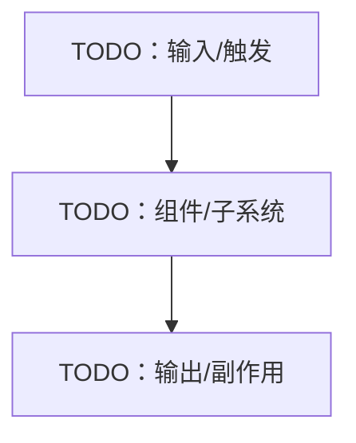
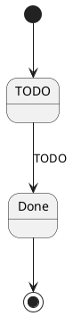

<!-- Copyright The Project Template Contributors -->

# TODO Software Design Document (SDD)

> **使用说明**
>
> 复制为 `docs/SDD.md` 或子系统设计文档后填写。SDD 描述当前设计如何落地；如果只是探索方案，先写 RFC/Spec。

## 文档信息

- 项目/子系统：TODO
- 适用版本/阶段：TODO
- 状态：草案 / 已接受 / 已废弃
- 最后审阅日期：YYYY-MM-DD
- 关联 SAD/ADR/RFC/Spec/Plan：TODO

## 设计目标

### 目标

- TODO

### 非目标

- TODO

## 设计概览

## 模块与职责

| 模块/文件 | 职责 | 输入 | 输出 | 依赖 |
|-----------|------|------|------|------|
| TODO | TODO | TODO | TODO | TODO |

## 接口设计

| 接口/API/命令/Topic | 调用方 | 参数/消息 | 返回/事件 | 错误 |
|---------------------|--------|-----------|-----------|------|
| TODO | TODO | TODO | TODO | TODO |

## 数据模型

| 类型/表/Schema | 字段 | 约束 | 兼容性 | 真值源 |
|----------------|------|------|--------|--------|
| TODO | TODO | TODO | TODO | TODO |

## 状态机与流程

| 状态/步骤 | 触发 | 动作 | 失败处理 |
|-----------|------|------|----------|
| TODO | TODO | TODO | TODO |

## 算法与关键逻辑

- TODO：说明核心算法、选择理由、复杂度、边界条件。
- TODO：如果算法选择来自 ADR/RFC，在此链接。

## 并发、资源与生命周期

| 资源/任务 | 所有者 | 生命周期 | 同步/隔离方式 | 清理方式 |
|-----------|--------|----------|---------------|----------|
| TODO | TODO | TODO | TODO | TODO |

## 错误处理与可观测性

| 场景 | 错误类型 | 处理方式 | 日志/指标/事件 |
|------|----------|----------|----------------|
| TODO | TODO | TODO | TODO |

## 配置、环境变量与生成物

| 项目 | 来源 | 默认值/版本 | 更新方式 | 验证方式 |
|------|------|-------------|----------|----------|
| TODO | TODO | TODO | TODO | TODO |

## 硬件、生产、供应商与 SOP

> 不适用时删除本节。

| 关联项 | 文档 | 影响 | 验证方式 |
|--------|------|------|----------|
| 硬件设计 | TODO | TODO | TODO |
| 生产/SOP | TODO | TODO | TODO |
| 供应商交付物 | TODO | TODO | TODO |

## 测试与验证

| 验证项 | 命令/步骤 | 运行位置 | 需要硬件/外部服务 | 超时 | 通过标准 |
|--------|-----------|----------|--------------------|------|----------|
| TODO | TODO | TODO | TODO | TODO | TODO |

## 兼容性与迁移

- 向后兼容策略：TODO
- 迁移步骤：TODO
- 回滚方式：TODO

## 开放问题

- TODO
