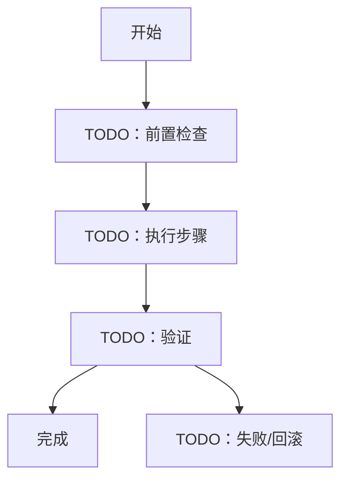

<!-- Copyright The Project Template Contributors -->

# TODO 标准作业流程（SOP）

> **使用说明**
>
> 用于生产、部署、发布、硬件诊断、供应商验收、现场维护、回滚等重复流程。复制到 `docs/sop/` 后填写。

## 适用范围

- 流程名称：TODO
- 适用版本/批次/环境：TODO
- 操作角色：TODO
- 需要权限：TODO
- 关联文档：TODO

## 前置条件

| 条件 | 检查方式 | 不满足时处理 |
|------|----------|--------------|
| TODO | TODO | TODO |

## 产物来源

| 产物 | 生成环境 | 宿主机路径 | 容器内路径 | 校验方式 | 回滚使用 |
|------|----------|------------|------------|----------|----------|
| TODO | TODO：宿主机 / Dev Container / CI | TODO | TODO | TODO | TODO |

## 流程图

## 操作步骤

| 步骤 | 操作 | 命令/工具 | 预期结果 | 失败处理 |
|------|------|-----------|----------|----------|
| 1 | TODO | TODO | TODO | TODO |
| 2 | TODO | TODO | TODO | TODO |
| 3 | TODO | TODO | TODO | TODO |

## 验收标准

- TODO

## 记录与追溯

| 记录项 | 保存位置 | 负责人 | 保留时间 |
|--------|----------|--------|----------|
| TODO | TODO | TODO | TODO |

## 回滚与升级

- 回滚触发条件：TODO
- 回滚步骤：TODO
- 升级条件：TODO
- 通知对象：TODO
