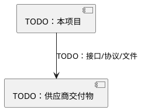

<!-- Copyright The Project Template Contributors -->

# TODO 供应商记录

> **使用说明**
>
> 用于记录供应商、外协团队、第三方 SDK、硬件模块、生产服务或认证服务。复制到 `docs/suppliers/` 后填写。

## 基本信息

| 字段 | 内容 |
|------|------|
| 供应商/组织 | TODO |
| 联系窗口 | TODO |
| 交付物类型 | TODO：硬件 / 固件 / SDK / 文档 / 生产服务 / 认证 |
| 适用项目版本/批次 | TODO |
| 合同/授权/保密要求 | TODO |

## 交付物清单

| 交付物 | 来源 | 版本/批次 | 校验方式 | 存放位置 | 是否进入仓库 |
|--------|------|-----------|----------|----------|----------------|
| TODO | TODO | TODO | TODO | TODO | TODO |

## 集成方式

- [ ] 通过包管理器管理：TODO
- [ ] 通过 `3rd/` git submodule 管理：TODO
- [ ] 通过 vendor copy 管理：TODO
- [ ] 通过下载脚本或内部制品库获取：TODO

选择 vendor copy 或下载脚本时，必须说明为什么不能使用包管理器或 git submodule。

## 接口与责任边界

| 边界 | 本项目负责 | 供应商负责 | 验收标准 |
|------|------------|------------|----------|
| TODO | TODO | TODO | TODO |

## 验收与升级

| 场景 | 步骤 | 运行位置 | 通过标准 | 回滚方式 |
|------|------|----------|----------|----------|
| 首次接入 | TODO | TODO：常驻 Dev Container / CI | TODO | TODO |
| 版本升级 | TODO | TODO：常驻 Dev Container / CI | TODO | TODO |
| 生产异常 | TODO | TODO：常驻 Dev Container / self-hosted runner / 产线容器环境 | TODO | TODO |

## 风险

- 许可证/授权风险：TODO
- 供应连续性风险：TODO
- 安全/漏洞响应：TODO
- 替代方案：TODO
